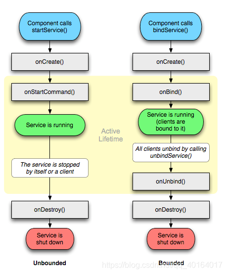

## 服务简介

Android 实现程序后台运行的解决方案，非常适合用于执行那些不需要和用户交互而且还要求长期运行的任务。服务的运行不依赖于任何用户界面，即使当程序被切换到后台，或者用户打开了另外一个应用程序，服务仍然能够保持正常运行。

不过需要注意的是，服务并不是运行在一个独立的进程当中的，而是依赖于创建服务时所在的应用程序进程。当某个应用程序进程被杀掉时，所有依赖于该进程的服务也会停止运行。

另外，服务并不会自动开启线程，所有的代码都是默认运行在主线程当中的。也就是说，我们需要在服务的内部手动创建子线程，并在这里执行具体的任务，否则就有可能出现主线程被阻塞住的情况。

## 基础使用

### 1. 定义一个继承 Service 的类

```java
public class MyService extends Service {

    @Override
    public IBinder onBind(Intent intent) {
        return null;
    }

    // onCreate()方法会在服务创建的时候调用
    @Override
    public void onCreate() {
        super.onCreate();
        Log.d("MyService", "onCreate executed");
    }

    // onStartCommand()方法会在每次服务启动的时候调用
    @Override
    public int onStartCommand(Intent intent, int flags, int startId) {
        Log.d("MyService", "onStartCommand executed");
        return super.onStartCommand(intent, flags, startId);
    }

    // onDestroy()方法会在服务销毁的时候 调用
    @Override
    public void onDestroy() {
        super.onDestroy();
        Log.d("MyService", "onDestroy executed");
    }
}
```

在 AndroidManifast.xml 中声明

```java
<service
    android:name=".MyService"
    android:enabled="true"
    android:exported="true">
</service>
```

### 2、启动和停止服务

```java
Intent startIntent = new Intent(this, MyService.class);
startService(startIntent); // 启动服务

Intent stopIntent = new Intent(this, MyService.class);
stopService(stopIntent); // 停止服务

// 注意：此处没有与活动绑定，如果调用startService()之后，没有调用stopService()，服务就会一直处于运行状态；
// 想要服务自己停止，只需要在 MyService 的任何一个位置调用 stopSelf() 方法就能让这个服务停止下来了
```

### 3、服务与活动的通信

服务与活动进行通信依靠的是 binder。

service 端

```java
//在service中定义一个继承Binder的类，自己定义业务相关的方法，并在onBind方法中返回一个该类的实例

public class MyService extends Service {

   public MyService() {
   }

   private DownloadBinder mBinder = new DownloadBinder();

   class DownloadBinder extends Binder {

       public void startDownload() {
           Log.d("MyService", "startDownload executed");
       }

       public int getProgress() {
           Log.d("MyService", "getProgress executed");
           return 0;
       }

   }

   @Override
   public IBinder onBind(Intent intent) {
       return mBinder;
   }

   @Override
   public void onCreate() {
       super.onCreate();
       Log.d("MyService", "onCreate executed");
   }

   @Override
   public int onStartCommand(Intent intent, int flags, int startId) {
       Log.d("MyService", "onStartCommand executed");
       return super.onStartCommand(intent, flags, startId);
   }

   @Override
   public void onDestroy() {
       super.onDestroy();
       Log.d("MyService", "onDestroy executed");
   }
}
```

Activity 端

```java
public class MainActivity extends AppCompatActivity implements View.OnClickListener{

    //定义Binder
   private MyService.DownloadBinder downloadBinder;

    //定义ServiceConnection
    // 这里重写了 onServiceConnected()方法和 onServiceDisconnected()方法， 前者是在操作者连接一个服务成功时被调用，而后者是在服务崩溃或被杀死导致的连接中断时被调用，而如果我们自己解除绑定时则不会被调用。在 onServiceConnected()方法中，我们又通过向下转型得到了 DownloadBinder 的实例，我们可以通过这个实例来调用 DownloadBinder 中的任何 public 方法，即实现了指挥服务干什么，服务就去干什么的功能。 需要注意的是，与服务绑定是一个异步的过程，也就是说，在这一刻我们绑定服务，下一刻我们去操作binder对象，也许它还为null，这就容易引起空指针异常，正确的做法是把这些操作放到绑定成功之后，确保万无一失。
   private ServiceConnection connection = new ServiceConnection() {

       @Override
       public void onServiceDisconnected(ComponentName name) {
       }

       @Override
       public void onServiceConnected(ComponentName name, IBinder service) {
           downloadBinder = (MyService.DownloadBinder) service;
            //正确做法如下
           downloadBinder.startDownload();
           downloadBinder.getProgress();
       }
   };

   @Override
   protected void onCreate(Bundle savedInstanceState) {
       super.onCreate(savedInstanceState);
       setContentView(R.layout.activity_main);
       Button startService = (Button) findViewById(R.id.start_service);
       Button stopService = (Button) findViewById(R.id.stop_service);
       startService.setOnClickListener(this);
       stopService.setOnClickListener(this);
       Button bindService = (Button) findViewById(R.id.bind_service);
       Button unbindService = (Button) findViewById(R.id.unbind_service);
       bindService.setOnClickListener(this);
       unbindService.setOnClickListener(this);
       Button startIntentService = (Button) findViewById(R.id.start_intent_service);
       startIntentService.setOnClickListener(this);
   }

   @Override
   public void onClick(View v) {
       switch (v.getId()) {
           case R.id.start_service:
               Intent startIntent = new Intent(this, MyService.class);
               startService(startIntent); // 启动服务
               break;
           case R.id.stop_service:
               Intent stopIntent = new Intent(this, MyService.class);
               stopService(stopIntent); // 停止服务
               break;
           case R.id.bind_service:
               Intent bindIntent = new Intent(this, MyService.class);
               bindService(bindIntent, connection, BIND_AUTO_CREATE); // 绑定服务， 传入 BIND_AUTO_CREATE 表示在活动和服务进行绑定后自动创建服务。这会使得 MyService 中的 onCreate()方法得到执行，但 onStartCommand()方法不会执行。如果是第一次绑定，那么 onCreate方法和onBind方法会被调用，然后服务进入运行阶段，如果再次点击绑定按钮，onCreate和onBinder并不会再次被调用，这个过程中它们仅被调用一次，而onServiceConnected()则会被调用。之后如果其他客服端再次调用绑定方法，系统不会创建新的Sevice实例,也不会再调用onBind()方法,只会直接把IBinder对象传递给其他后来增加的客户端。
               break;
           case R.id.unbind_service:
               unbindService(connection); // 解绑服务
               break;
           case R.id.start_intent_service:
               // 打印主线程的id
               Log.d("MainActivity", "Thread id is " + Thread.currentThread(). getId());
               Intent intentService = new Intent(this, MyIntentService.class);
               startService(intentService);
               break;
           default:
               break;
       }
   }
}

// 需要注意的是，在连接中断状态再去做解除绑定操作会引起一个异常，在MainActivity销毁之前没有进行解除绑定也会导致后台出现异常信息

解决方法：

// 定义一个标记
private boolean binded;

@Override
public void onServiceConnected(ComponentName name, IBinder service) {
    // 绑定成功时给标记赋值
   binded = true;
}

//封装后的解除绑定的方法
public void unbind(View view) {
   unbindService();
}

// 在Activity销毁之前进行解除绑定
@Override
protected void onDestroy() {
   super.onDestroy();
   unbindService();
}

// 解除绑定时先判断连接状态
private void unbindService() {
   if (binded) {
       unbindService(conn);
       binded = false;
   }
}
```

### 3、服务的生命周期

一旦在项目的任何位置调用了 Context 的 startService()方法，相应的服务就会启动起来， 并回调 onStartCommand()方法。如果这个服务之前还没有创建过，onCreate()方法会先于 onStartCommand()方法执行。服务启动了之后会一直保持运行状态，直到 stopService()或 stopSelf()方法被调用。

注意虽然每调用一次 startService()方法，onStartCommand()就会执行一次，但实际上每个服务都只会存在一个实例。所以不管你调用了多少次 startService()方法， 只需调用一次 stopService()或 stopSelf()方法，服务就会停止下来了。

另外，还可以调用 Context 的 bindService()来获取一个服务的持久连接，这时就会回调服务中的 onBind()方法。类似地，如果这个服务之前还没有创建过，onCreate()方法会先于 onBind()方法执行。之后，调用方可以获取到 onBind()方法里返回的 IBinder 对象的实例，这样就能自由地和服务进行通信了。只要调用方和服务之间的连接没有断开，服务就会一直保持运行状态。

当调用了 startService()方法后，又去调用 stopService()方法，这时服务中的 onDestroy() 方法就会执行，表示服务已经销毁了。类似地，当调用了 bindService()方法后，又去调用 unbindService()方法， onDestroy()方法也会执行。

但是需要注意， 我们是完全有可能对一个服务既调用了 startService()方法，又调用了 bindService()方法的，这种情况下要同时调用 unbindService()和 stopService() 方法，onDestroy()方法才会执行。 因为使用 bindService 来绑定一个启动的 Service,注意是已经启动的 Service!!! 系统只是将 Service 的内部 IBinder 对象传递给 Activity,并不会将 Service 的生命周期与 Activity 绑定,因此调用 unBindService( )方法取消绑定时,Service 也不会被销毁。



### 4、其他

#### 创建一个前台服务

```java
//在service的onCreate（）方法里加入如下代码，则可以将一个服务提升为前台服务

Intent intent = new Intent(this, MainActivity.class);
PendingIntent pi = PendingIntent.getActivity(this, 0, intent, 0);

Notification notification = new NotificationCompat.Builder(this)
    .setContentTitle("This is content title")
    .setContentText("This is content text")
    .setWhen(System.currentTimeMillis())
    .setSmallIcon(R.mipmap.ic_launcher)
    .setLargeIcon(BitmapFactory.decodeResource(getResources(), R.mipmap.ic_launcher))
    .setContentIntent(pi)
    .build();

    // 调用 startForeground()方法后就会让 MyService 变成一个前台服务，并在系统状态栏显示出来
    // 注意：startForeground()第一个参数必须大于0，否则无法在通知栏显示
    startForeground(1, notification);
```

#### IntentService 的使用

IntentService 的作用： 可以创建一个异步的、会自动停止的服务；

```java
public class MyIntentService extends IntentService {

    public MyIntentService() {
        super("MyIntentService"); // 调用父类的有参构造函数
    }

    //必须重写onHandleIntent()，这个方法中可以去处理一些具体的逻辑，而且不用担心 ANR 的问题，因为这个方法已经是在子线程中运行的。
    @Override
    protected void onHandleIntent(Intent intent) {
    // 打印当前线程的id
    Log.d("MyIntentService", "Thread id is " + Thread.currentThread(). getId());
    }

    @Override
    public void onDestroy() {
        super.onDestroy();
        Log.d("MyIntentService", "onDestroy executed");
    }
}

//启动该服务，同样是创建Intent,调用startService()方法
Intent intentService = new Intent(this, MyIntentService.class);
startService(intentService);
```

#### 创建定时任务

Alarm 机制具有唤醒 CPU 的功能，可以保证每次需要执行定时任务的时候 CPU 都能正常工作。

```java
//在LongRunningService的onStartCommand添加以下代码
@Override
public int onStartCommand(Intent intent, int flags, int startId) {

    new Thread(new Runnable() {
        @Override
        public void run() {
            //执行具体的业务操作
            Log.d("LongRunningService", "executed at " + new Date(). toString());
        }
    }).start();

    AlarmManager manager = (AlarmManager) getSystemService(ALARM_SERVICE);
    int anHour = 60 * 60 * 1000; // 这是一小时的毫秒数
    long triggerAtTime = SystemClock.elapsedRealtime() + anHour;
    Intent i = new Intent(this, AlarmReceiver.class);

    // 当定时任务被触发的时候，广播接收器的 onReceive() 方法就可以得到执行
    PendingIntent pi = PendingIntent.getBroadcast(this, 0, i, 0);
    manager.set(AlarmManager.ELAPSED_REALTIME_WAKEUP, triggerAtTime, pi);
    return super.onStartCommand(intent, flags, startId);
}
```

注册一个静态广播接收器并声明

```java
//静态广播接收器
public class AlarmReceiver extends BroadcastReceiver {
    @Override
    public void onReceive(Context context, Intent intent) {
        Intent i = new Intent(context, LongRunningService.class);
        context.startService(i);
    }
}


//配置文件中注册
<service android:name = ".LongRunningService">
    </service>
<receiver android:name=".AlarmReceiver">
    </receiver>
```

在需要启动服务的地方调用

```java
Intent i = new Intent(context, LongRunningService.class);
context.startService(i);
```

当然，我们还可以这么做:

```java
// Intent i = new Intent(this, AlarmReceiver.class);
// PendingIntent pi = PendingIntent.getBroadcast(this, 0, i, 0);

// 改为：
Intent i = new Intent(this,LongRunningService.class);
PendingIntent pi = PendingIntent.getService(this, 0, i, 0);
```

需要注意的是，从 Android 4.4 版本开始，Alarm 任务的触发时间将会变得不准确， 有可能会延迟一段时间后任务才能得到执行。这并不是个 bug，而是系统在耗电性方面进行的优化，如果需要更加准确，使用 AlarmManager 的 setExact() 方法来替代 set() 方法，可以保证任务更加准时执行。
